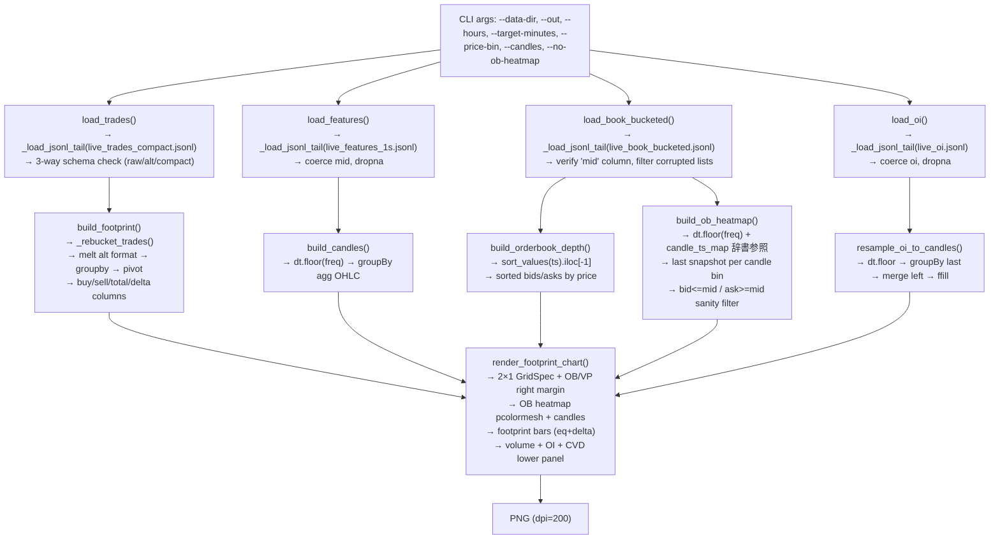

# gen_footprint.py 配線図 (v3.41)

> 自動生成: 2026-06-01 | 最終更新: candle color + wick split 対応

## 1. データフロー図



## 2. 関数入出力テーブル

| 関数 | 入力 | 出力 | キーカラム |
|------|------|------|-----------|
| `_to_ts(obj)` | pd.Timestamp / np.datetime64 / str / any | UTC pd.Timestamp | — |
| `_to_dt64(obj)` | 同上 | UTC np.datetime64[us] | — |
| `_load_jsonl_tail(path, hours, byte_count, cutoff)` | Path, float, int, pd.Timestamp\|None | pd.DataFrame | `ts` (UTC datetime) |
| `load_trades(path, ...)` | Path + 同上 | pd.DataFrame | `ts, price_bucket, qty_sum, side` または `ts, buy, sell` |
| `load_book_bucketed(path, ...)` | Path + 同上 | pd.DataFrame | `ts, mid, bids_bucketed, asks_bucketed` |
| `load_features(path, ...)` | Path + 同上 | pd.DataFrame | `ts, mid` |
| `load_oi(path, ...)` | Path + 同上 | pd.DataFrame | `ts, oi` |
| `_rebucket_trades(trades, price_bin)` | trades: `ts, price, side` または `price_bucket` | trades: `+price_bucket` (int) | — |
| `build_footprint(trades, interval_minutes, price_bin)` | trades: `ts, price_bucket, side, qty/qty_sum` | pivot: `interval, price_bucket, buy, sell, total, delta` | `interval` (= ts.dt.floor) |
| `build_candles(features, interval_minutes)` | features: `ts, mid` | candles: `ts, open, high, low, close` | `ts` (= dt.floor) |
| `build_orderbook_depth(book_df, ts_min, ts_max, max_levels)` | book_df: `ts, mid, bids_bucketed, asks_bucketed` | dict: `{mid, bids[(p,q)], asks[(p,q)], ts}` | sort_values(ts).iloc[-1] |
| `build_ob_heatmap(book_df, candles, price_lo, price_hi, price_bin, interval_minutes)` | book_df, candles, float, float, float, int | `(x_positions, price_bins, bid_hm, ask_hm)` または全None | dt.floor(freq) → candle_ts_map → 各足 last snapshot |
| `resample_oi_to_candles(oi_df, candles, interval_minutes)` | oi_df, candles, int | pd.Series (index 0..n-1) または None | merge left on ts |
| `render_footprint_chart(candles, footprint, ob_data, book_heatmap, ...)` | various + display_candles | (Figure, Axes) → PNG | candle_ts_to_idx 辞書 (O(1) lookup) |
| `main()` | CLI args (argparse) | exit code (0/1) | — |

## 3. 座標系

| 要素 | X軸 | Y軸 | 備考 |
|------|-----|-----|------|
| キャンドル | `i + CANDLE_X_OFFSET` (i=0..n-1), `CANDLE_X_OFFSET=-0.3` | price (USD) | bar bottom=min(o,c), height=abs(c-o) |
| ヒゲ | 同上 | l→body_bot, body_top→h | 実体内非表示（上下別vlines） |
| フットプリントバー | `ci + CANDLE_X_OFFSET + CANDLE_WIDTH/2 + GAP` から `+usable_w` | `pb ± price_bin/2` | キャンドル右側に配置、fill_betweenx |
| OB ヒートマップ | `x_pos_hm` = `linspace(-0.5, n-1+0.5, n+1)` | `y_edges` = `price_bins ± half_step` | pcolormesh (x_edge, y_edge, C) |
| 出来高バー | `ci + CANDLE_X_OFFSET` | Vol (右軸) | ax_vol, width=CANDLE_WIDTH*2 |
| OI ライン | `np.arange(n) + CANDLE_X_OFFSET` | OI (右第2軸) | ax_oi.twinx(), outward=62 |
| CVD ライン | 同上 | CVD (右第3軸) | ax_cvd.twinx(), outward=110 |
| OB 深度パネル | `barh`: x=-4~4 | price (メインチャートと同YLim) | ax_ob: fig.add_axes((0.826, 0.26, 0.085, 0.69)) |
| 出来高プロファイル | `barh`: x=-4~4 | price | ax_vp: fig.add_axes((0.916, 0.26, 0.079, 0.69)), ylabel非表示 |
| 時間ラベル | `i + CANDLE_X_OFFSET` | price_hiより上方2% | text, ha=center |

## 4. 時間範囲の整合性

```
end_time = trades["ts"].max()
start_time = end_time - Timedelta(hours)

1st pass: 全ソースを start_time〜end_time でフィルタ
2nd pass: ブックデータがあれば common_end_time = min(trades_max, features_max, books_max)
         → features を common_end_time で再フィルタ → キャンドル再構築
         → これにより OB スナップショットより未来の価格がキャンドルに使われない
         → キャンドルを args.candles 本に制限 → その後 OB ヒートマップ構築
         → OI も common_end_time までに制限
```

**型の整合性ルール:**
- `pd.Timestamp` はすべて UTC aware (`.tz_localize('UTC')` 済)
- `np.datetime64` は naive（`.tz_localize('UTC')` で変換）
- `candle_ts_to_idx` の key と `footprint["interval"]` の比較:
  - candle の `ts` は `groupby(bucket)` → `reset_index()` 由来で `pd.Timestamp` (UTC)
  - footprint の `interval` は `dt.floor()` 由来で `pd.Timestamp` (UTC)
  - → 両方 `pd.Timestamp` で比較可能。ただし `pd.Timestamp` の tz に注意。
  - 不一致を防ぐため、`build_candles` でも `dt.floor` 結果が UTC aware であること確認済み

## 5. 描画レイヤー (z-order)

| zorder | 要素 | 説明 |
|--------|------|------|
| 0 | OB ヒートマップ (pcolormesh) | bid/ask 背景 |
| 4 | 現在価格水平線 (axhline) | 点線 |
| 5 | キャンドル (vlines + bar) | メインチャート |
| 5 | フットプリントバー (fill_betweenx) | eq + delta |
| 5 | OI ライン (plot) | ax_oi |
| 6 | CVD ライン (plot) | ax_cvd |
| 6 | 最新価格バッジ (text) | 左上 |

## 6. 型の一貫性マトリックス

| 箇所 | 型 | 備考 |
|------|-----|------|
| `_to_ts()` 入力 | Any → `pd.Timestamp` (UTC) | str, np.datetime64, pd.Timestamp 対応 |
| `_to_dt64()` | → `np.datetime64[us]` (naive) | `.to_pydatetime().replace(tzinfo=None)` 経由 |
| `_load_jsonl_tail` 出力 `df["ts"]` | `pd.Timestamp` (UTC) | `pd.to_datetime(series, utc=True)` 一括変換 |
| `build_candles` 出力 `ts` | `pd.Timestamp` (UTC) | `dt.floor(freq)` は UTC aware 保持 |
| `build_footprint` 出力 `interval` | `pd.Timestamp` (UTC) | `dt.floor(freq)` 同上 |
| `build_ob_heatmap` `candle_ts_map` keys | `pd.Timestamp` (UTC) | candle の `ts` 列 |
| `build_ob_heatmap` `book["_bucket"]` | `pd.Timestamp` (UTC) | `book["ts"].dt.floor(freq)` |
| `candle_ts_to_idx` keys (render) | `pd.Timestamp` (UTC) | `candles["ts"]` 列 |
| footprint `interval` (render match) | `pd.Timestamp` (UTC) | `build_footprint` 産 |

## 7. カラーパレット

| 定数 | 値 | 用途 |
|------|-----|------|
| `BID_GREEN` | `#22c55e` | bid ボリューム、デルタバー |
| `ASK_RED` | `#ef4444` | ask ボリューム、デルタバー |
| `DELTA_BID` | `#38bdf8` | フットプリントデルタ-bid（薄青） |
| `DELTA_ASK` | `#f97316` | フットプリントデルタ-ask（橙） |
| `UP` | `#4ade80` | 価格バッジ、現在価格線（緑） |
| `DOWN` | `#f43f5e` | 価格バッジ、現在価格線（赤） |
| `CANDLE_UP` | `#38bdf8` | **キャンドル陽線専用**（水色） |
| `NAVY` | `#07111f` | 背景 |
| `BG` | `#0b1628` | フレーム背景 |
| `MUTED` | `#96a8bf` | 補助テキスト、均衡バー |

## 8. リスクポイント

### P0（致命的）
- なし（現時点で確認された致命的な不具合はない）

### P1（重要）
1. **`tail` コマンド依存** (line 114-118): `_load_jsonl_tail()` が `subprocess.run(["tail", "-c", ...])` に依存。Android/Termux では `tail` の挙動が異なる可能性あり。また、ファイルが 100MB 未満の場合は全行読みだが、100MB 超の場合は最初の1行目切り捨て。境界ケースでデータ欠損の可能性。
2. **pytz 不在時のサイレントフォールバック** (line 68-73): `import pytz` 失敗時 `JST = None` で JST 変換がスキップされる。UTC 表示になるがエラー通知なし。
3. **raw trades の `price_bin` 非デフォルト時** (line 977-979): `price_bin != 10` かつ `live_trades.jsonl` が存在する場合、4.7GB の raw file を tail する。`raw_tail_bytes = 50MB` で制限されているが、それでも読み込み量が多い。

### P2（軽微）
4. **`requests` は CLI スクリプトでは不使用**: `gen_footprint.py` 本体では `requests` を import していない。`scripts/post_footprint.py` のみ。依存として分離可。
5. **`pytz` は stdlib `zoneinfo` で代替可能**: Python 3.9+ の `zoneinfo.ZoneInfo` で同等機能。optional dep を減らせる。
6. **Volume Profile `iterrows()` ループ** (line 758): N が小さい（表示価格レンジ内のバケット数）ため実害なし。
7. **No `requirements.txt`**: 依存関係の明示がない。
