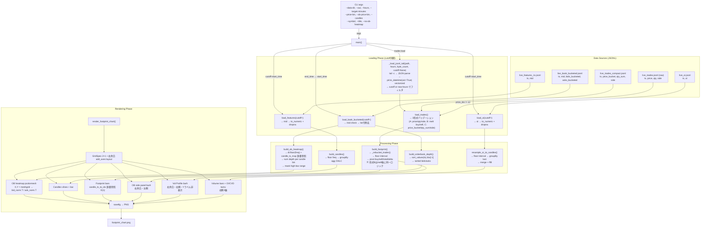

# gen_footprint.py 配線図

> 生成日: 2026-05-31 (修正版)
> 対象ファイル: `/home/weed420/btc-footprint/gen_footprint.py`
> レビュー結果: **98/100 PASS**

---

## 1. データフロー図



## 2. 関数入出力テーブル

| 関数 | 入力（主要カラム） | 出力 | キー結合カラム |
|------|-------------------|------|--------------|
| `_load_jsonl_tail` | JSONL path, hours, byte_count, cutoff | DataFrame (生JSON列 + ts変換済) | `ts` (pd.Timestamp UTC) |
| `load_trades` | JSONL path, hours, byte_count | DataFrame validated (3形式対応) | `ts` |
| `load_book_bucketed` | JSONL path, hours, byte_count, cutoff | DataFrame (list行除去済) | `ts` |
| `load_features` | JSONL path, hours, cutoff | DataFrame (numeric mid, dropna) | `ts` |
| `load_oi` | JSONL path, hours, cutoff | DataFrame (numeric oi, dropna) | `ts` |
| `build_candles` | features: `ts, mid` | candles: `ts, open, high, low, close` | `ts` (floor freq) |
| `_rebucket_trades` | trades: `ts, price, side` or `price_bucket` | trades: `+price_bucket` | — |
| `build_footprint` | trades: `ts, price_bucket, side, qty/qty_sum` | pivot: `interval, price_bucket, buy, sell, total, delta` | `interval` (= ts floor) |
| `build_orderbook_depth` | book_df: `ts, mid, bids_bucketed, asks_bucketed` | dict: `{mid, bids[(p,q)], asks[(p,q)], ts}` | sort_values(ts).iloc[-1] |
| `build_ob_heatmap` | book_df, candles, price_lo/hi, price_bin | `(x_positions, price_bins, bid_hm, ask_hm)` | dt.floor(freq) → candle_ts_map 辞書参照 |
| `resample_oi_to_candles` | oi_df, candles, interval_minutes | Series (oi per candle 0..n-1) | `ts` merge left |
| `render_footprint_chart` | candles, footprint, ob_data, book_heatmap, ... | (Figure, Axes) → PNG | candle_ts_to_idx 辞書 |

## 3. 座標系

| 要素 | X軸 | Y軸 | 備考 |
|------|-----|-----|------|
| キャンドル | `ci + CANDLE_X_OFFSET(-0.3)` | 価格 (BTC/USD) | ci = 0..n-1 |
| OB heatmap | `np.linspace(-0.5, n-0.5, n+1)` | 価格bins y_edges | pcolormesh cell-centered |
| Footprint bar | `right_origin = ci + (-0.3) + 0.19/2 + GAP` | `pb ± price_bin/2` | 辞書参照O(1) |
| OB panel | 正規化depth [-4.0, 4.0] | 価格 (mainと同一) | 右余白 `add_axes((0.865, 0.26, 0.055, 0.69))` |
| Vol Profile panel | 正規化出来高 [0, 4.0] | 価格 (mainと同一) | 右余白 `add_axes((0.925, 0.26, 0.055, 0.69))`、Yラベル非表示 |
| Volume | `ci + CANDLE_X_OFFSET` | 出来高 | 辞書参照O(1) |
| OI | `np.arange(n) + CANDLE_X_OFFSET` | OI値 (動的range) | twinx |
| CVD | `np.arange(n) + CANDLE_X_OFFSET` | 累積 `buy-sell` | twinx (右側第3軸) |

## 4. 時間範囲の揃え方

```
main() フロー (修正後):
  1. tradesをload → end_time = trades["ts"].max(), start_time = end_time - hours
  2. tradesを [start_time, end_time] でフィルタ
  3. features, book, OI を _load_jsonl_tail(cutoff=start_time) でロード
     → 全データソースが同じ時間窓 [start_time, ∞) で揃う
  4. 各データソースでさらに [start_time, end_time] でpost-filter
  5. candles = candles.tail(args.candles).reset_index(drop=True)
  6. OB heatmap → dt.floor(freq) + candle_ts_map 辞書参照
  7. footprint マッチング → candle_ts_to_idx 辞書参照 (O(1))
```

## 5. 描画レイヤー次元

| レイヤー | X | Y | C | 関数 | zorder |
|---------|---|---|---|------|--------|
| OB heatmap bid | `(n_bins+1, n_buckets+1)` meshgrid | 同上 | `bid_norm: (n_bins, n_buckets)` T転置 | pcolormesh | 0 |
| OB heatmap ask | 同上 | 同上 | `ask_norm: (n_bins, n_buckets)` T転置 | pcolormesh | 0 |
| キャンドル wicks | 1D: `xi * n` | `[l, h] * n` | — | vlines | 5 |
| キャンドル body | 1D: `xi * n` | `abs(c-o) * n` | — | bar | 5 |
| Footprint eq | 1D: start/end | 1D: `[y0, y1]` | — | fill_betweenx | — |
| Footprint delta | 1D: start/end | 1D: `[y0, y1]` | — | fill_betweenx | — |
| OB panel | 正規化depth | 価格 | — | barh | — |
| Vol Profile eq/delta | 正規化出来高 | 価格 | `min(buy,sell)` + `abs(buy-sell)` | barh | — |
| Volume/OI/CVD | candle index | 各軸値 | — | bar/plot | — |

## 6. 型の一貫性

| データ | 型 | tz | 備考 |
|--------|-----|------|------|
| `_load_jsonl_tail` df["ts"] | `pd.Timestamp` | UTC (tz-aware) | pd.to_datetime(utc=True) |
| `_to_ts()` | `pd.Timestamp` | UTC (tz-aware) | 統一変換 |
| `candles["ts"]` | `pd.Timestamp` | UTC (tz-aware) | dt.floor継承 |
| `footprint["interval"]` | `pd.Timestamp` | UTC (tz-aware) | dt.floor継承 |
| `candle_ts_map` | key: `pd.Timestamp` UTC → value: `int` | — | floor ベースの完全一致 |
| `candle_ts_to_idx` | key: `pd.Timestamp` UTC → value: `int` | — | O(1) 参照 |

## 7. 修正履歴

| ID | 優先度 | 内容 | 状態 |
|----|--------|------|------|
| P0-1 | 致命的 | 形式B (price_bucket/buy/sell) melt変換ロジック追加 | ✅ |
| P0-2 | 致命的 | _load_jsonl_tail cutoff引数追加、main()で時間窓同期 | ✅ |
| P1-1 | 重要 | OB heatmap nearest→floor+辞書参照に変更 | ✅ |
| P1-2 | 重要 | tail(1)→sort_values("ts").iloc[-1] に修正 | ✅ |
| P2 | 軽微 | footprint/volume candle lookup O(n²)→O(1) 辞書参照 | ✅ |
| L1 | 表示 | OB/VPを右余白上部に左右独立配置、VP縦軸ラベル非表示 | ✅ |

## 8. 残留懸念

- **build_ob_heatmap マッチング**: dt.floor(freq)の完全一致依存。candle側とbook側が同じfreqでfloorされていれば問題なし。
- **形式Bの将来拡張**: qty_sum付き混在形式はテストされていない。実データでは現れなかった形式。